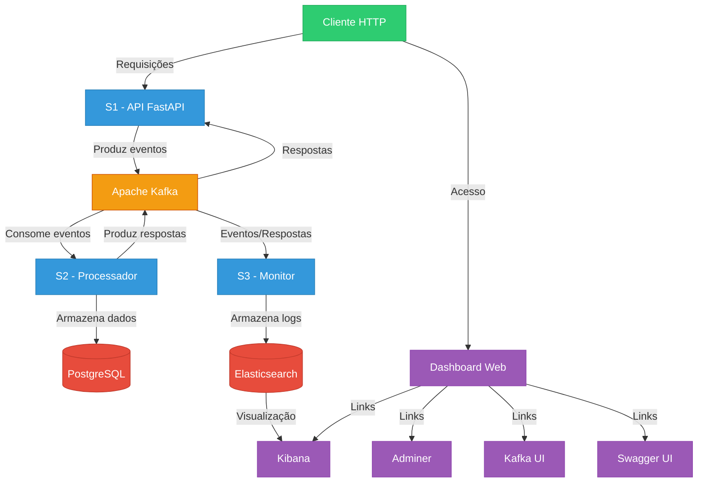

# Plataforma de Streaming com Polyglot Persistence

## 📋 Visão Geral

Este projeto implementa uma plataforma de streaming moderna com arquitetura orientada a eventos e persistência poliglota (utilizando diferentes bancos de dados para diferentes tipos de dados). A aplicação é construída como um sistema distribuído baseado em microserviços, com comunicação assíncrona via Kafka.

## 🏗️ Arquitetura

O sistema é composto por 3 serviços principais e um dashboard, todos containerizados via Docker:



### Serviços

1. **S1 (API)**: Serviço de API RESTful desenvolvido com FastAPI, responsável por:
   - Receber requisições HTTP
   - Gerar eventos para o Kafka
   - Acompanhar o status das operações via correlation_id
   - Expor endpoints para gerenciamento de usuários, assinaturas e pagamentos

2. **S2 (Processador)**: Serviço de processamento de eventos, responsável por:
   - Consumir eventos do Kafka
   - Persistir os dados no PostgreSQL
   - Processar operações de negócio
   - Enviar respostas via Kafka

3. **S3 (Monitor)**: Serviço de monitoramento e logging, responsável por:
   - Consumir eventos de todos os tópicos do Kafka
   - Armazenar logs no Elasticsearch
   - Monitorar fluxos de requisições e respostas
   - Fornecer fallback para logs em arquivo quando Elasticsearch não estiver disponível

4. **Dashboard**: Interface web simples para visualização e acesso a todos os componentes da plataforma

### Bancos de Dados

O sistema utiliza persistência poliglota:

- **PostgreSQL**: Armazena dados relacionais de usuários, assinaturas e pagamentos
- **MongoDB**: Disponibilizado para dados não estruturados (não utilizado na versão atual)
- **Redis**: Disponibilizado para caching (não utilizado na versão atual)
- **Elasticsearch**: Armazena logs de sistema para análise e monitoramento

### Ferramentas de Administração

- **Adminer**: Administração do PostgreSQL
- **Kafka UI**: Visualização e administração dos tópicos Kafka
- **Kibana**: Visualização e análise dos logs no Elasticsearch

### Fluxo de Dados

A comunicação entre os serviços segue o padrão 

## 🚀 Como Executar

### Pré-requisitos

- Docker
- Docker Compose
- Python 3.x (para o script de inicialização)

### Passos de Inicialização

1. Clone o repositório:
```bash
git clone [URL_DO_REPOSITORIO]
cd [NOME_DO_DIRETORIO]
```

2. Execute o script de inicialização:
```bash
python start.py
```

O script `start.py` vai:
- Verificar se Docker e Docker Compose estão instalados
- Verificar e criar a estrutura de diretórios necessária
- Parar os containers existentes (se houver)
- Iniciar os containers via Docker Compose
- Abrir o dashboard no navegador

3. Após a inicialização, o dashboard estará disponível em:
```
http://localhost:8089
```

### Portas Utilizadas

- **8000**: API principal (S1)
- **8089**: Dashboard
- **8080**: Kafka UI
- **8081**: Adminer (Administração PostgreSQL)
- **5601**: Kibana
- **9200**: Elasticsearch
- **5432**: PostgreSQL
- **27017**: MongoDB
- **6379**: Redis

## 🔧 Estrutura do Projeto

```
.
├── .env                  # Variáveis de ambiente
├── .gitignore            # Arquivos ignorados pelo git
├── docker-compose.yaml   # Configuração dos containers Docker
├── start.py              # Script de inicialização
├── s1/                   # Serviço API (FastAPI)
│   ├── Dockerfile
│   ├── requirements.txt
│   └── app/
│       └── main.py
├── s2/                   # Serviço Processador
│   ├── Dockerfile
│   ├── requirements.txt
│   └── app/
│       └── main.py
├── s3/                   # Serviço Monitor
│   ├── Dockerfile
│   ├── requirements.txt
│   └── app/
│       └── main.py
└── dashboard/            # Interface Web
    └── html/
        ├── index.html
        └── style.css
```

## 📝 Como Testar

1. **Acessar o Dashboard:**
   - Abra http://localhost:8089 no navegador
   - Use os links para navegar entre os diferentes componentes

2. **Testar a API (Swagger UI):**
   - Acesse http://localhost:8000/docs
   - Utilize a documentação interativa para testar os endpoints

3. **Endpoints Principais:**
   - `POST /usuarios` - Criar um novo usuário
   - `POST /usuarios/{id}/assinatura` - Criar uma assinatura para um usuário
   - `POST /usuarios/{id}/pagamento` - Registrar um pagamento para um usuário
   - `POST /usuarios/{id}/config` - Atualizar configurações de um usuário
   - `GET /status/{correlation_id}` - Verificar o status de uma operação
   - `GET /health` - Verificar a saúde do serviço

4. **Visualizar Logs:**
   - Use o Kibana em http://localhost:5601 para visualizar os logs no Elasticsearch
   - Configure um index pattern para "system_logs" na primeira vez

5. **Monitorar Tópicos Kafka:**
   - Acesse http://localhost:8080 para visualizar os tópicos e mensagens no Kafka

## 📊 Tópicos Kafka

- **user_events**: Eventos relacionados aos usuários (criação, atualização, etc.)
- **response_events**: Respostas do processamento de eventos

## 🗃️ Tabelas PostgreSQL

- **usuarios**: Armazena informações dos usuários
- **assinaturas**: Armazena dados de assinaturas
- **pagamentos**: Registra pagamentos realizados
- **preferencias**: Armazena preferências e configurações dos usuários

## 🧰 Tecnologias Utilizadas

- **Backend**: Python 3.11
- **API**: FastAPI
- **Processamento Assíncrono**: asyncio, aiokafka
- **Banco de Dados**: PostgreSQL, MongoDB, Redis, Elasticsearch
- **Mensageria**: Kafka
- **Frontend**: HTML, CSS
- **Containerização**: Docker, Docker Compose
- **Monitoramento**: Kibana, Kafka UI, Adminer

## 📈 Escalabilidade e Melhorias Futuras

O sistema foi projetado para ser escalável:

1. **Escalabilidade Horizontal**:
   - Todos os serviços podem ser replicados para aumentar a capacidade
   - Kafka gerencia o balanceamento das mensagens entre instâncias

2. **Possíveis Melhorias**:
   - Implementar autenticação e autorização
   - Adicionar monitoramento com Prometheus e Grafana
   - Expandir o uso dos demais bancos de dados (MongoDB e Redis)
   - Implementar testes automatizados
   - Adicionar CI/CD pipeline
   - Implementar serviço de recomendação baseado em histórico de visualização

## ⚠️ Solução de Problemas

- **Erro ao iniciar os containers:** Verifique se as portas necessárias não estão em uso por outros aplicativos
- **S1 não conecta ao Kafka:** O serviço tentará reconectar automaticamente. Se persistir, reinicie o container
- **S2 não conecta ao PostgreSQL:** Verifique os logs e certifique-se de que as variáveis de ambiente estão corretas
- **Dashboard não carrega:** Verifique se o container do Nginx está em execução

Para interromper todos os serviços:
```bash
docker-compose down
```

Para visualizar logs de um serviço específico:
```bash
docker logs [nome_do_container]
```

## 🧩 Detalhes Técnicos

### Comunicação Assíncrona

O sistema utiliza o padrão de correlation_id para rastrear o fluxo de mensagens:

1. S1 gera um UUID único (correlation_id) para cada operação
2. O correlation_id é enviado junto com o evento para o Kafka
3. S2 processa o evento e envia uma resposta com o mesmo correlation_id
4. S1 armazena as respostas em um dicionário indexado pelo correlation_id
5. Clientes podem consultar o status via endpoint `/status/{correlation_id}`

### Resiliência

O sistema foi projetado para ser resiliente:

- **Reconnection**: Serviços tentam reconectar automaticamente ao Kafka e PostgreSQL
- **Fallback para Logs**: S3 usa um arquivo local como fallback quando Elasticsearch não está disponível
- **Containers Resilientes**: Configuração `restart: on-failure` garante que os containers sejam reiniciados em caso de falha